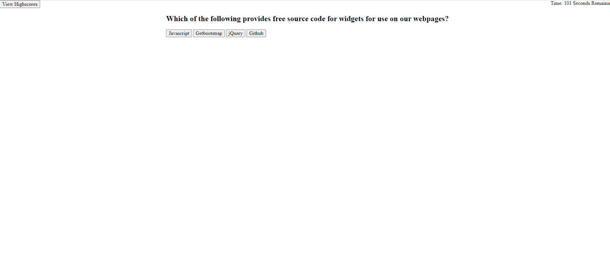

# Code-Quiz
This application is a simple coding quiz with 7 questions, all multiple choice. 
The quiz logs your score & reduces your total time remaining for an incorrect answer on a question. 
From there, you can submit your score for a display on the highscores.
The highscore list is currently not functioning, not is any proper CSS added to this document. The CSS seemed like an unnecessary time sink while I was trying to get the js working, especially since we were instructed to not use bootstrapping in this assignment. I will add later if necessary. 

